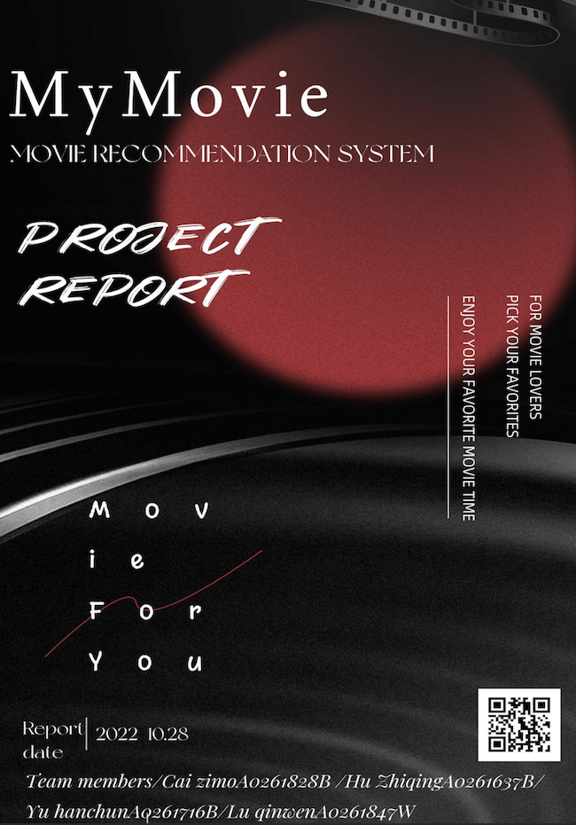

## SECTION 1 : PROJECT TITLE
## My Movies: Intelligent Movie Recommendation System

## SECTION 2 : EXECUTIVE SUMMARY / PAPER ABSTRACT
With the rapid development of the economy, movies have entered people's lives and are loved and welcomed by the masses. We enjoy the fun of movie boost and suffer from picking one movie to watch at the same time since all of us must be familiar with the scene: Endlessly scrolling through Netflix, watching trails on YouTube, looking up IMDb ratings, wasting half an hour and still cannot decide what to watch. Although there are various video websites, most of them are piled up with popular information and lack of personalized recommendations. It is difficult for users, especially those who suffer from decidophobia, to find movies that meet their personal interests and tastes. 
So this project takes this as an opportunity to integrate multiple recommendation algorithms to make recommendations in appropriate situations and help users find their favorite movies in different situations in a simple manner. 

---

## SECTION 3 : CREDITS / PROJECT CONTRIBUTION

| Official Full Name  | Student ID (MTech Applicable)  | Work Items (Who Did What) | Email (Optional) |
| :------------    |:---------------:| :-----| :-----|
| LU QINWEN| A0261847W | Dispatch the tasks to my teammates fluently;Build a high-performance Go back-end server;Search and study the recommendation algorithm(CB\CL), get them known by my teammates.| e0983241@u.nus.edu|
| HU ZHIQING    | A0261637B | Learn and research content-based recommendation algorithms and collaborative filtering algorithms and perform model evaluation;Conduct market research and business analysis and project report| e0983031@u.nus.edu|
| YU HANCHUN    | A0261716E | Use Vue framework to realize Front-end design, reactive data binding and composed view components with backend, video production and editing | e0983110@u.nus.edu|
| CAI ZIMO      | A0261628B | Data collection, front-end web page development,  back-end server development: Spring Boot server and Flask server, and dealt with the interation between two servers | zimocai06@u.nus.edu|

---

## SECTION 4 : VIDEO OF PROMOTION & SYSTEM MODELLING

[More Videos...](./Video/)

---

## SECTION 5 : USER GUIDE

### [ 1 ] Installment

1.1 Golang server configuration 

(1) Open the package file you downloaded and follow the prompts to install Go. 

(2) The package installs the Go distribution to /usr/local/go. The package should put the /usr/local/go/bin directory in your PATH environment variable. You may need to restart any open Terminal sessions for the change to take effect. 

(3) Verify that you've installed Go by opening a command prompt and typing the following command: $ go version

1.2 Python server configuration 

For simplifying the configuration process of our system, we used Flask framework and deployed the python-based server for recommendation-related service in Google Colaboratory. The configuration steps are as follows: 

(1) Register and sign in google account and upload the project files to the google drive

(2) Open main.ipynb file in google colab.

(3) Run the code in main.ipynb for installing the necessary libraries, like ngrok, pymysql and flask.

(4) Run the following code to import the model files in the project, load preprocessed data, configure the MySQL connecter and prepare the top K recommendation. 

(5) Run the flask-related code block and activate the server

1.3 Java server configuration 

(1) Install Java 11 Link: [here](https://www.oracle.com/sg/java/technologies/javase/jdk11-archive-downloads.html)

(2) Install Maven 3.8.6

(3) Import and run the project

(4) The dependencies are as follows:

1.4 Redis configuration Download address: [here](https://github.com/tporadowski/redis/releases)

Redis supports 32-bit and 64 bit. This needs to be selected according to the actual situation of your system platform. Here we download

Redis-x64-xxx Zip the package to disk C. After decompression, rename the folder Redis. Redis supports 32-bit and 64 bit. This needs to be selected according to the actual situation of your system platform. Here we download Redis-x64-xxx Zip the package to disk C. After decompression, rename the folder Redis.

Open a cmd window and use the cd command to switch the responding directory to run it

At this time, another cmd window is opened, and the original one should not be closed, otherwise,  the server will not be accessible. Switch to the Redis directory to run: 
> redis-cli.exe -h 127.0.0.1 -p 6379

---
## SECTION 6 : PROJECT REPORT / PAPER

`Refer to project report at Github Folder: ProjectReport`

**Recommended Sections for Project Report / Paper:**

# 1. INTRODUCTION 

## 1.1 Background and objetcives 

With the rapid development of the economy, movies have entered people's lives and are loved and welcomed by the masses. We enjoy the fun of movie boost and suffer from picking one movie to watch at the same time since all of us must be familiar with the scene: Endlessly scrolling through Netflix, watching trails on YouTube, looking up IMDb ratings, wasting half an hour and still cannot decide what to watch. Although there are various video websites, most of them are piled up with popular information and lack of personalized recommendations. It is difficult for users, especially those who suffer from decidophobia, to find movies that meet their personal interests and tastes. So this project takes this as an opportunity to integrate multiple recommendation algorithms to make recommendations in appropriate situations and help users find their favorite movies in different situations in a simple manner. 

## 1.2 Movie recommendation systems development status

Now there are many big movie recommendation websites and software, such as Netflix, PickAMovieForMe, Douban, and so on. After analyzing their website we found that they have their characteristics. In addition to knowing what a user is watching on Netflix, it also looks at things like how long the user watched, which device the user is watching Netflix on, and how long he watched. When the user enters a search query, the top results it returns are based on the actions of other members who have entered the same or similar queries. PickAMovieForMe, a well-known movie recommendation website, uses a quiz-based movie picker to find movies that fit the users' moods, occasions and individual preferences. As a famous movie evaluation social platform in China, Douban applies the item-based collaborative filtering algorithm to make personalized movie recommendations for users based on movie data and user viewing and review data.

## 1.3 Commercial value and market research 

The core of the movie recommendation system is the recommendation algorithm. The recommendation algorithm is widely used in the Internet industry, and the commercial value of the recommender system is reflected in various aspects. One well-known case is TikTok. Ad targeting using the recommendation algorithm has undoubtedly played an important role in the gradual rise of TikTok's advertising revenue. According to ByteDance's annual financial statements, as of 2020, TikTok used targeted advertising strategies to generate $202.1 billion in revenue in 4.6 years. With the help of the recommendation algorithm, the precise placement of advertisements can be realized, and the advertisements can generate greater commercial value by matching the huge traffic of personalized recommendations and the precise interests of users. Similarly to this, the e-commerce platform recommends products to the people who may buy them through personalized recommendation, promotes the purchase of the products, and obtains more shares from the merchants. Similar to how the role of a real estate agent can be realized through e-commerce. Movie recommendation systems also have a huge market. Netflix as a large American subscription streaming service company, hold the Netflix Prize competition.

# 2. PROBLEM DESCRIPTION

With the development of information technology and the Internet, people have gradually moved from an era of information scarcity to an era of information overload. In this era, both information consumers and information producers are facing great challenges. As an information consumer, it is very difficult to find the information you are interested in from a large amount of information; As an information producer, it is also a very difficult thing to make the information produced stand out and attract the attention of the majority of users. Recommendation system is an important tool to solve this contradiction. The task of the recommendation system is to contact users and information. On the one hand, it helps users find valuable information for themselves, and on the other hand, information can be displayed in front of users who are interested in it, to achieve a win-win situation for information consumers and information producers. Not just used in movie recommendation, the recommendation system is widely used in other Internet industries. In the abstract, the recommendation algorithm is a fitting function for content satisfaction, involving user characteristics and content characteristics. Collaborative Filtering algorithm and Content-based recommendation algorithm are the two most widely used recommendation algorithms in movie systems. After much consideration and discussion, we notice that the issues we need to consider include the following aspects: what kind of data is used to train the machine to judge the movies that the user may like, how to obtain the data set of the user's watching movies, and how to understand the user's favorite without infringing on the user's privacy type of movie, etc. As a result, our team aims to design a personalized recommendation system based on the combination of Collaborative Filtering algorithm and Content-based recommendation algorithm and build the supporting system architecture and server system. 

# 3. RECOMMENDATION SYSTEMS

## 3.1 Common recommending methods

Generally speaking, we may decide which movie to watch in the end in the following ways: Ask a friend or netizens. We may open the chat tool, find some good friends who often watch movies, and ask them if they have any movies to recommend. Also, we can log in to the microblog, post on a topic, "I want to see a movie", and wait for movies recommended by the enthusiasts. This method is called social recommendation in the recommendation system, that is, let friends recommend items to themselves. Use the search engine, and search for their favorite actors. We can search for our favorite actors and directors to see movies we have not seen in the returned results. Pretty much similar to this, the recommendation system can automatically analyze users' movie history, find the actors and directors they might like, and then recommend other movies. This recommendation method is called content-based recommendation in the recommendation system. check the ranking list, such as the IMDB ranking list to see what other people are watching and what other people like, and then find a movie that is widely praised. This method can be further expanded: if you can find a group of users with similar historical interests and see what movies they have been watching recently, the results may be more consistent with your interests than the broad popular leaderboards. This method is called collaborative filtering-based recommendation. The above three methods are the essence of our recommendation system, which connects users and items in a certain way.

## 3.2 System architecture

By burying a point in the movie website system, users' click events (such as which movie they like or the rating of a movie) are obtained and the information is sent to the recommendation system. The recommendation system makes corresponding processing according to the information, and stores the recommendation results in the MySQL database. The web front end displays the recommended movie to users through the query database. 

## 3.3 Recommendation algorithm

The recommendation algorithm is a fitting function for content satisfaction, involving user characteristics and content characteristics.

### 3.3.1 Content-based recommendation

The basic principle of the Content-based recommendation algorithm is to obtain the user's interest preference according to the user's historical behavior and recommend a target object similar to his interest preference for the user. Three core steps of content-based personalized recommendation: Recommend based on user historical behavior records Both user and target features are represented by explicit labels, which are used to make recommendations Users and objects are embedded in the same vector space, and recommendation is made based on vector similarity Thus, we have to complete its item profiles, user profiles, and similarity measure. However,  we also need to pay attention to that the algorithm cannot recommend content other than the user's interests, and the user must have a wider range of interests for the recommendation.

### 3.3.2 Collaborative Filtering

We use two CF algorithms. One is a user-user-based CF algorithm whose basic principle is to find a set D similar to the user's score for a user, and then estimate the user's score based on set D, the other is item-item based, whose core is to find other similar items for an item S, and estimate the item S' rating based on similar items. Two steps of the UserCF algorithm: 1. First, calculate the similarity between the target user and users A, B, C, and D according to the previous user's rating of the movie (or the existing user vector), and find the n users that are most similar to the target user. 2. According to the similarity of the ratings of the n users to the movie X and the target user, the target user's rating of the movie X will be guessed. If the rating is relatively high, movie X will be recommended to the target user, otherwise, it will not be recommended. To measure the similarity, the two algorithms are similar, both of them use the calculated value of vector cosine angle as a similarity.

## 3.4 Data preprocessing

ETL (Extract-Transform-Load), which is used to describe a series of processing processes between the data source and final storage, is used in data preprocessing. It generally goes through three stages: extraction, transformation, and loading. As mentioned above, the dataset we build contains three different sheets, we extracted data from Spider and MovieLens and combined them with user data collected ourselves from our website by burying a point on the client side, and then uploading to the log collection web service through the HTTP protocol. For missing movie rating values, we marked them as 0 for missing rating values. We sorted out the data of the movie year, genre, etc. and loaded our users' and movies’ data in our database for further use. First, we create a user-item matrix of users and movies in order to map the ratings of all users to all movies. For data that users have not rated, that is, missing values problem, we mark them as 0 to solve the problem. Then, according to the content-based recommendation algorithm, we use the movie genre and producing year as the main feature values. Another process is to divide the year of the movie into 3 types: 90s, 00s and 10s, the type is also divided into Action and the other 24 species, and we use the one-hot encoding format for marking. In this way, we can extract the characteristics of the movie, and analyze the similarity between the movies.

......

---
## SECTION 7 : MISCELLANEOUS

`Refer to Github Folder: Miscellaneous`

### Rating.csv
* User data collected by Spider/System/Open source data set
* Including millions of movies and some useful user data

### Movies.csv

* Original data is from movielens small latest
* Movie details retrieved from IMDB/TMDB website using web crawler

### references

* a folder of reference materials for developing our system

### imgs

* a folder of some imgs shown in README.md

